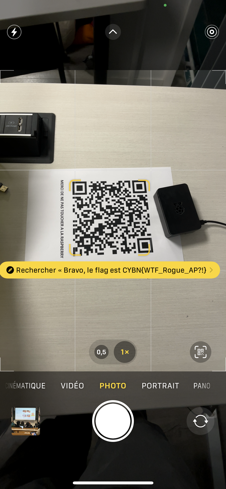

## Find Me

> Categorie : Hardware
>
> Ok, ce point wifi n'est clairement pas légitime. Il faudrait le trouver sur le campus.
>
> A vous de trouver une méthode pour le localiser !
>
> Challenge à effectuer en physique uniquement
>
> Difficulté : Easy
>
> Auteur : Maestran

Va falloir se lever de sa chaise 😫 (en vrai génial)

En activant les paramètres développeurs pour android, on peut voir sous chaque réseau Wifi deux choses : 
- l'adresse MAC de l'AP
- la puissance en dB (donc négative)

Grâce à l'un on peut trouver la marque du fabricant (*data missing*) : Raspberry PI

Grâce à la deuxième, potentiellement calculer une distance.  
On se dit que flemme, c'est en salle admin, on trouve une Raspberry, "vire la, elle porte à confusion" qu'ils disent, donc c'est pas la bonne  

Et là, qu'est-ce qu'on voit au fond de la salle, caché derrière un sac ! (très smart)

🚩 `CYBN{WTF_Rogue_AP?!}`
