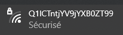
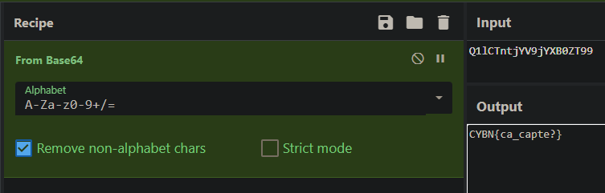

## Identify

> Categorie : Hardware
>
> Un agent ennemi s’est infiltré à la Cybernight !
> Nous l'avons vu passer sur une caméra avec un sac rempli de matériel puis sortir du campus.
>
> Nous pensons qu’il essaye de nous espionner sur le réseau wifi mais nous ne savons pas comment. Une idée de ce qu'il a pu faire ?
> 
> Challenge à effectuer en physique uniquement aux 4 étages du bâtiment A.
> N’hésitez pas à fouiller sur d’autres étages.
> Pas besoin d’aller demander la caméra au gardien.
>
> Difficulté : Easy
>
> Auteur : Maestran

Etant à l'étage challenger, juste à côté de la salle admin, je me dis que je devrais pas trop avoir à bouger de ma chaise s'ils veulent avoir un oeil sur leur chall "sur place"

Ca parle de WiFi, donc premier reflexe, regarder les réseaux Wifi : 

Suspect, n'est-ce pas ?  
Ce n'est évidemment pas le flag comme ça, et si c'était encodé ?

Je capte donc

🚩 `CYBN{ca_capte?}`
