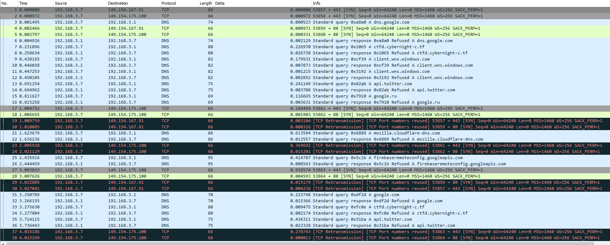
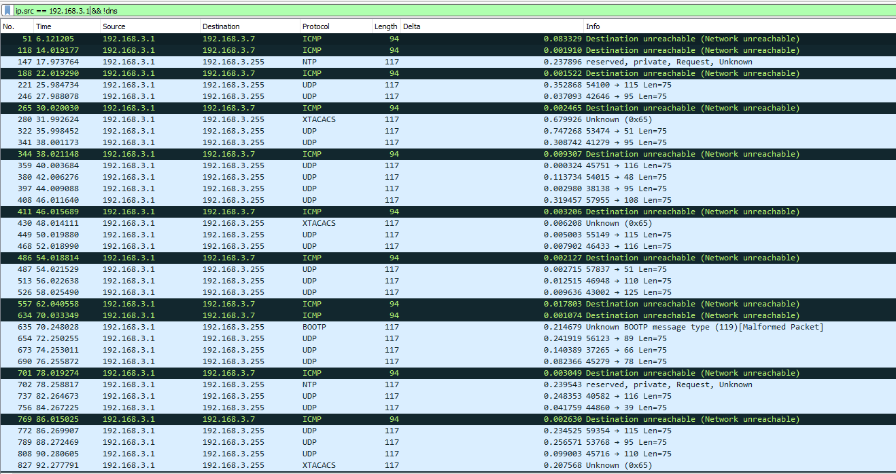
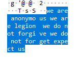
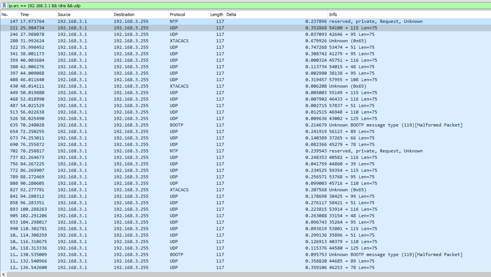
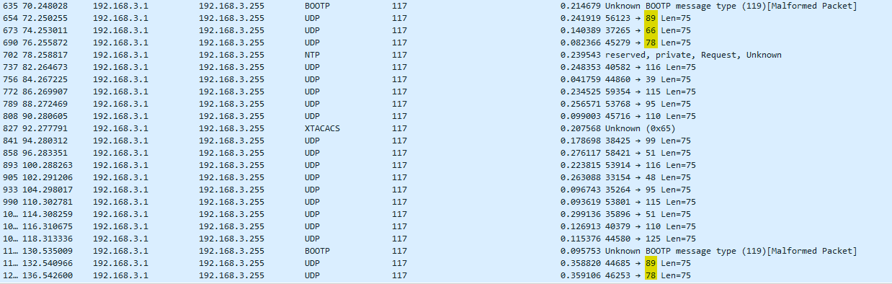
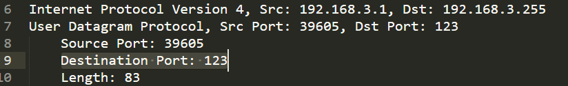

## Yo Listen

> Categorie : Hardware
>
> Bon super, on a trouvé son matos. Laissons le tourner pour l'instant. Il serait intéressant de voir ce que ce truc diffuse en boucle sur les postes qui se connectent.
> 
> Le code du wifi est "toto1234@".
> 
> Challenge à effectuer en physique uniquement
>
> Difficulté : Easy
>
> Auteur : Maestran

Bon on a domc une Rasp, et le mot de passe de sa WiFi <br/>
On s'y connecte.

Apparemment elle "diffuse" en boucle, bah go ouvrir Wireshark :


Mouais beaucoup de merde. On va virer les requetes DNS venant de mon ordi, et ne garder que ce que la rasp envoi (avec l'ip source 192.168.3.1):


C'est déjà mieux. 
3 Choses intéressantes à noter :

- Quand on à un peu l'habitude, doit pas y avoir autant d'UDP sans une raison.
- L'ip de destination de ces paquets UDP est un broadcast, donc envoie à tout le monde, donc très certainement ce qu'on cherche
- ya un petit message dans chacun de ces paquets (rien que du troll) : 


Ne gardons plus que ces paquets alors :


Ca c'est clean.

Bon maintenant ya des paquets de protocoles bizares, mais malformés : BOOTP et XTACACS

Passons, mais regardons ce qui diffère d'un paquet à l'autre.... <br/>
Le port source c'est normal, mais par contre le port de destination à l'air bien choisi <br/>
Et si c'était de l'ASCII ?? <br/>

| Letter | ASCII code |
|--------|------------|
| C      | 67         |
| Y      | 89         |
| B      | 66         |
| N      | 78         |

TIENS TIENS TIENS


BOOTP utilise le port 67, d'où le fait qu'il soit considéré comme malformé : ce n'est PAS une requête BOOTP


Et bien allons-y pour extraire en plain text (txt) la capture, et essayons d'extraire ça à laide de python:

Exemple : 



Solving : 
```py
with open('ports.txt') as f:
	lines = [l.strip() for l in f.readlines()]
	flag = ""
	for line in lines:
		if 'Destination Port:' in line:
			port = line.split('Destination Port:')[1].split()[0].strip()
			c = chr(int(port))
			flag += c

print(flag)
```

Ce qui donne : `{s_13_t0_l1st3n}CYBN{t's_n1c3t0_s3n}CYN{t's_n1c3_t0_l1s3nCYB{1t's_n1c3_t0_l1st3n}CBN{1t's_c3_t0_lst3n}CYBN{1t'_n1c3_t0_l1st3n}`

Puisque l'UDP à pour particularité de perde ses paquets dans la nature, on l'affiche plusieurs fois, et on essaie de le reconstituer, et bingo

🚩 `CYBN{1t's_n1c3_t0_l1s3n}`
