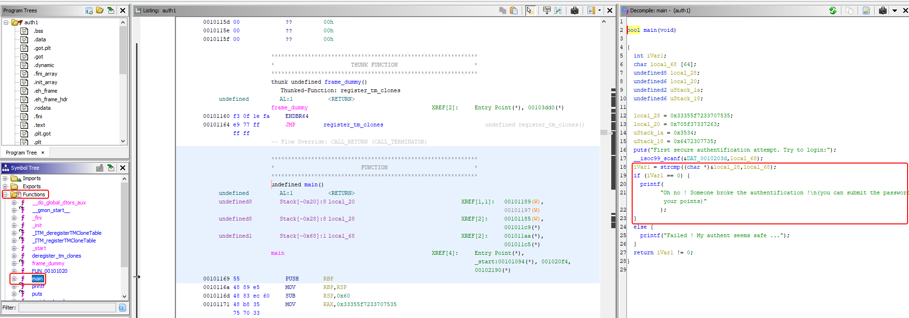
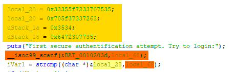
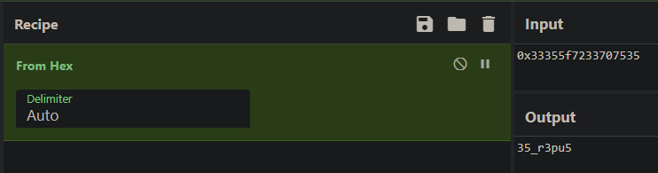
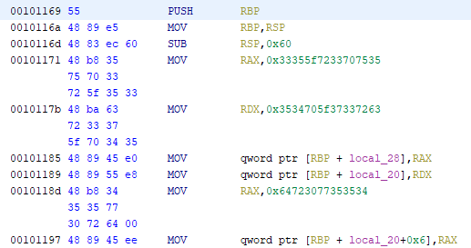
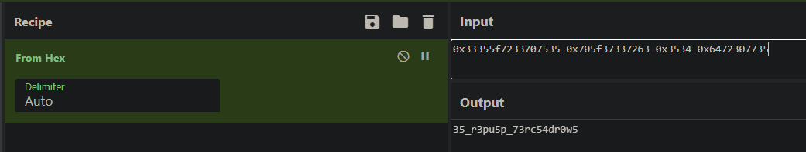

## Auth1

> Categorie : Reverse
>
> Faire une authentification sécurisée ça doit pas être si difficile que ça, si ?
> `Le flag n'est pas au format cybn{}`
>
> Difficulté : Easy
>
> Auteur : m00n


Bon bah du reverse, j'imagine que je vais ouvrir Ghidra ¯\_(ツ)_/¯

On ouvre alors le fichier `auth1` à décompiler. Une fois fait, on cherche à gauche les fonctions et la fonction `main` devrait nous intéresser



On voit un bloc qui dit qu'on peut soumettre le password si la condition précédente a été validée : 

```c
  iVar1 = strcmp((char *)&local_28,local_68);
  if (iVar1 == 0) // password found
```

 En langage C, `strcmp(char *, char *)` va comparer deux tableaux de caractères (char *), et renvoyer 0 si ces deux tableaux sont identiques. 
Il faut donc qu'on arrive à trouver la valeur de cette chaine de caractères.



On voit aussi à cette image que 4 variables sont initialisées, et que `iVarl` prendra la valeur de la comparaison de une seule d'entre elle (`local_28`) et d'une 6e (`local_68`)
On peut donc regarder la valeur initialisée de `local_28` et se dire que le flag se trouve dedans : 

 

on obtient `35_r3pu5`, ce qui n'est certainement pas suffisant. À savoir aussi qu'en C, les variables se lisent à l'envers dans ce genre de cas. La chaine est donc `5up3r_53` ce qui est un bon début, perso ca ma rappelle directement les fameux `super secret password`.

Ensuite, pour faire simple (parce que meme moi je ne comprends pas tout), dans les appels systèmes on trouve ça 



On voit des `MOV` surtout, avec deux variables de notre main, mais surtout avec leurs valeurs. Donc il se trouve qu'au moment de la comparaison, la valeur de la variable `local_28` à changé. En réalité, elle s'est fait concaténé les valeurs des 3 autres variables initialisées.
On regarde donc leur contenu : 



On a assurément un super secret password, mais pas dans le bon sens. `Opening python console...`

```py
a = "35_r3pu5"
b = "p_73rc"
c = "54"
d = "dr0w5"
flag = d+c+b+a
print(flag[::-1])

-> 5up3r_53cr37_p455w0rd
```

🚩 `cybn{5up3r_53cr37_p455w0rd}`
