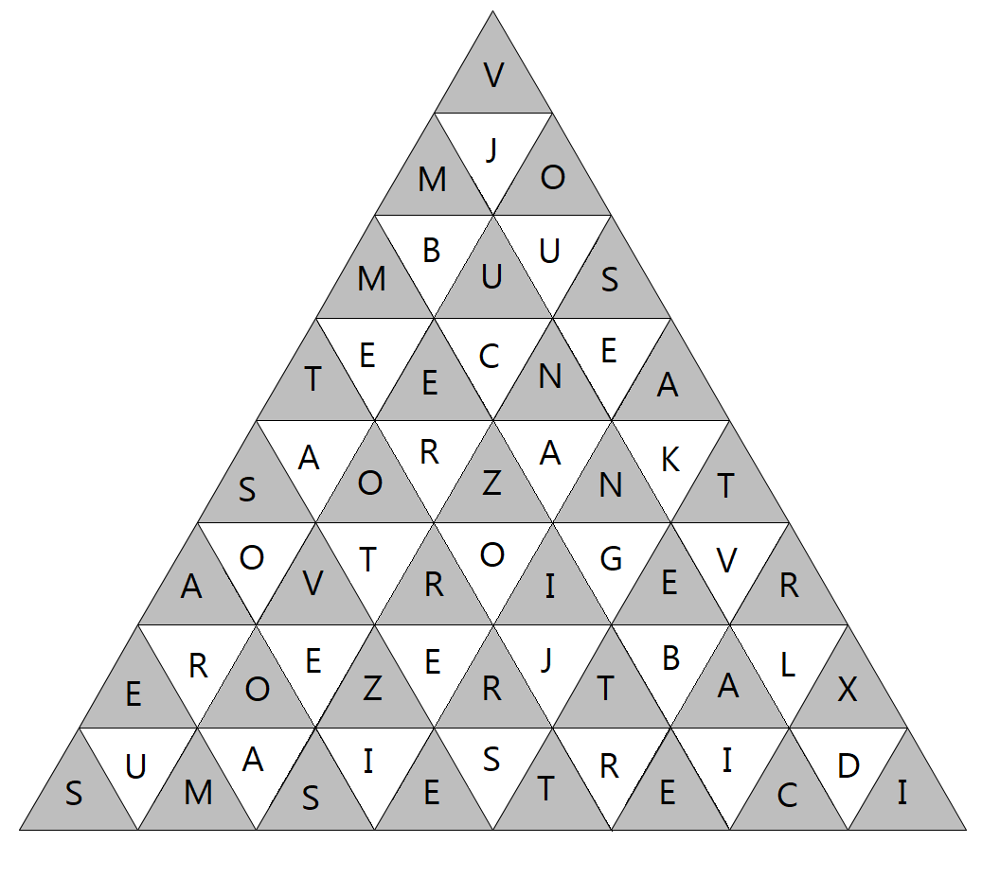
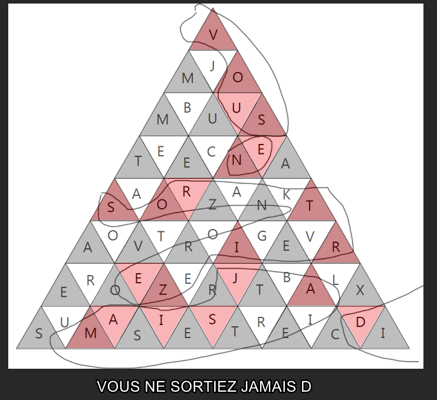
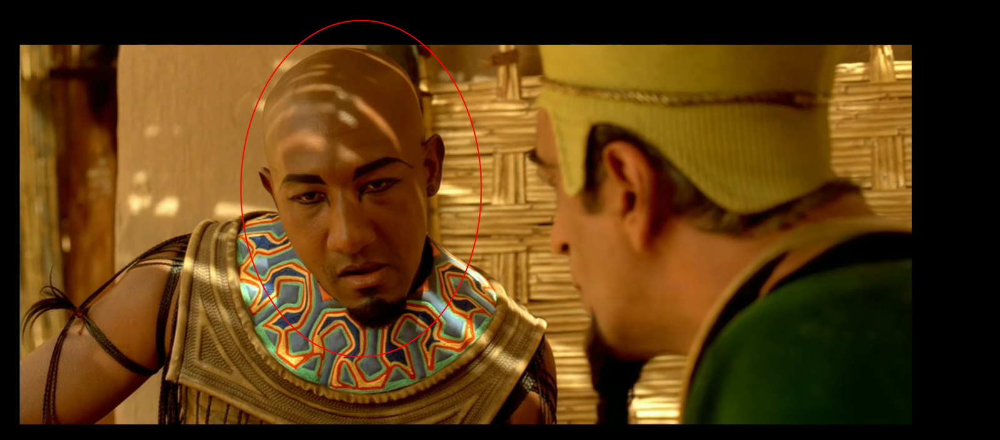
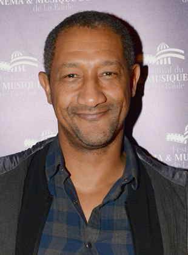

## Triforce

> Categorie : Stegano
>
> Il faut parfois extraire la clef pour trouver la solution.
>
> Retrouvez ici une citation d'un personnage de film. Le flag est son nom.
> 
> Format de flag : CYBN{Auteur}
>
> Difficulté : Medium
>
> Auteur : Marie-Jeanne
>
> File : 

Celui-là m'a pris du temps alors qu'il n'était pas si compliqué

Comme toujours quand j'ai des chall stegano avec image, je l'importe dans https://www.aperisolve.com/, et je ne trouve rien d'intéressant malheuresement (retenez bien) 
Je me disais que l'on devrait trouver une alternance de couleur, àn jouant avec les calques RGB, la luminosité, la variance, etc.. 
Il n'y a STRICTEMENT AUCUNE différrence entre chaque triangle gris et blanc, donc je commence à douter 

Je me penche sur le côté "auteur", et essaie de chercher une ref à Zelda, ou HUF (triforce et logo ref), toujours rien

Toutes mes manipulations avec les couleurs ne donnent rien, rien dans l'exif : c'est forcément avec les Lettres de l'image, mais lesquels ?

Ne tentez pas un "word unscrambler" qui essaie de trouver des mots avec des lettres en désordre, y'en a BEAUCOUP trop, impossible sans perdre ses facultés neuronales (devenir fou)

Puis un pote tente, et commence aussi par lancer la commande `binwalk` (contenue dans aperisolve, mon premier try) et là il me dit "ya un binwalk"
Chose très rare, donc souvent quand il y en a un, faut fouiller.
Ah oui, donc ca veut dire que j'avais juste mal regardé l'output du site :))))

On récupère le binwalk, un .zip, et on extrait. Ya quoi dedans ??? bah une image tiennnns donnnnnc

On a assurément ce que l'on cherchait depuis le début : la sélection des lettres voulues !

On peut alors superposer les images et voir comment on le lit. On se rend rapidement compte qu'il faut lire de haut en bas et de droie à gauche 

Tout de suite heureux d'avoir un peu de culture : ça vient du film Astérix et Obélix : Mission Cléopatre 
Mais j'ai pas le nom du perso

> “Vous ne sortirez jamais d'ici, étrangers ! Ce tombeau sera votre tombeau !”

On cherche alors dans le Cast du film, mais la personne en question a pas mal changé depuis (aled)
Il y a un seul nom de personnage qui me fait tiquer et l'acteur est EDOUARD MONTOUTE : 

Ressemblance pas flagrante avec l'age, le maquillage, mais il s'agit bien de lui et son personnage : Nexusis

🚩 `CYBN{Nexusis}`
