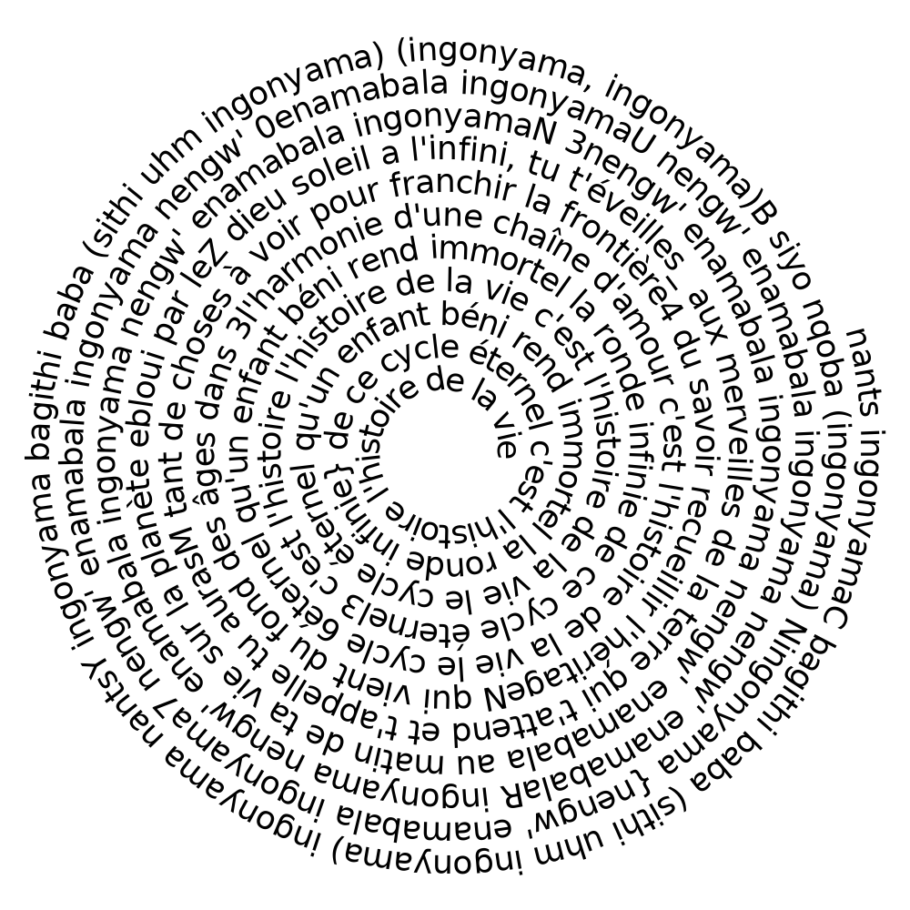
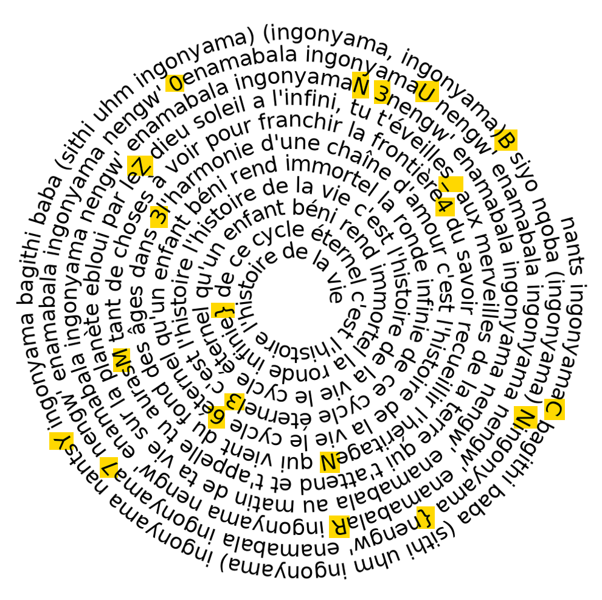

## Spirale

> Categorie : Stegano
>
> tourne tourne petit moulin frappe frappe petite main
>
> Difficulté : Easy
>
> Auteur : Marie-Jeanne
>
> File : 

Il fait mal aux yeux celui-là

En parcourant un peu le texte du fichier, puisque je ne trouvais rien sur https://www.aperisolve.com/, je me dis que ça doit etre dans le texte 
En lisant la spirale, on voit que des caractères en majuscule apparaissent, et que cela commence par CYBN

On se résout à ne pas l'automatiser et le faire avec ses petits yeux, et on note toutes les majuscules, lettres et caractères spéciaux dans l'ordre d'arrivée

🚩 `CYBN{70URN3Z_M4N363}`
