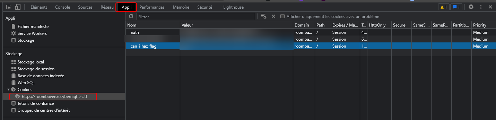
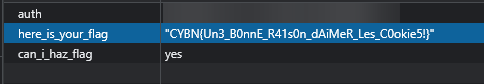

## Cooking Roomba

> Categorie : Web
>
> Aucune information.
>
> Difficulté : Easy
>
> Auteur : MrSheepSheep
> 
> Link : https://roombaverse.cybernight-c.tf/

On n'a aucune info, mais le titre va grandement aider.
Web + cooking = cookies

Donc il faut chercher à se connecter pour avoir des cookies (vide sinon)
On se crée un petit compte, et on se connecte

En ouvrant les Dev-tools (F12 ou Ctrl+Shift+I) > Appli > Cookies

Là deux cookies apparaissent: `auth : un-truc-du-style-123456789` et surtout `can_i_haz_flag : no`  
SUSPECT comme cookies n'est ce pas  

On peut modifier la valeur de `no` en `yes` évidemment et recharger la page. 
... Rien ne se passe, meme en fouillant sur toutes les pages 
... 
... On se déconnecte ? 
... Le cookie est toujours là, ok 
... 
... On se reconnecte ? 
... 
OH ! un nouveau cookie ! :D 

🚩 `"CYBN{Un3_B0nnE_R41s0n_dAiMeR_Les_C0okie5!}"`
