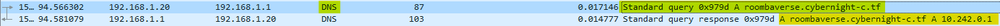
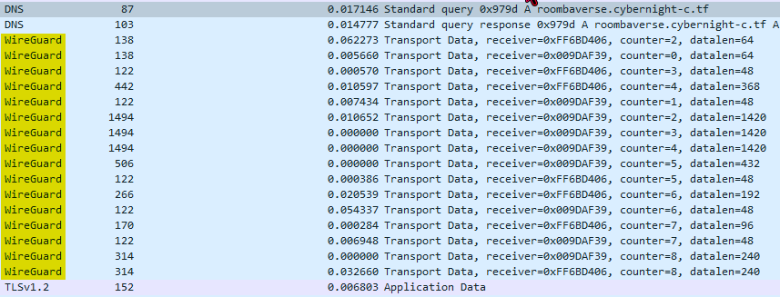
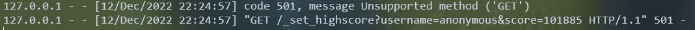
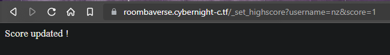
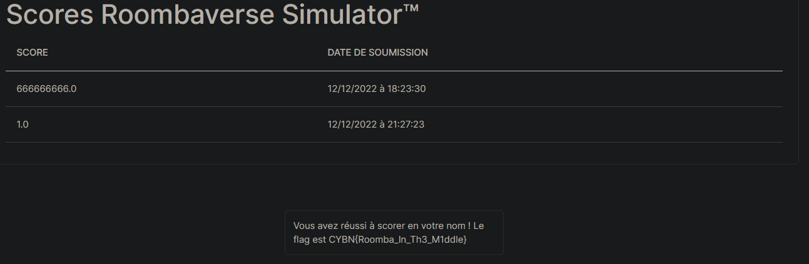

## Leaderboard

> Categorie : Web
>
> vvvvvvvvvvvvvvvvvvvvvvvvvvvvvvvvvvvvv
> 
> Soumettez un score Roombaverse Simulator avec votre propre compte
> 
> Note : vous devez télécharger et jouer à Roombaverse Simulator pour ce challenge.
>
> Difficulté : Hard
>
> Auteur : MrSheepSheep
>
> Link : https://roombaverse.cybernight-c.tf/

Alors en jouant au jeu du roomba simulator, on peut collecter 6 billes jaunes, et ce message apparait :


(PS : récupérer les 6 billes est déjà un challenge en soi avec son propre flag)

C'est exactement la première étape demandée dans la description, et ensuite ?<br/>
ça ne soumet aucun score sur notre compte puisque nous ne spécifions à aucun moment notre compte à l'application. <br/>

On se doute donc que la soumission passe forcément par des requêtes web.<br/>
Si on flush notre DNS (`ipconfig /flushdns` sur windows), ouvre wireshark, lance le simulator et réussi un score ; on remarque qu'une requête DNS est envoyée :


Conclusion : la requête http est donc dirigée vers https://roombaverse.cybernight-c.tf/

On ne voit pas la suite, parce que Wireguard : 



On peut donc tenter une stratégie : intercepter la requête en se faisant passer pour le serveur. <br/>
Pour cette recette, il nous faut :
- Un nom de domaine local correspondant
- Un serveur HTTPS fonctionnel

Commençons par éditer notre fichier `/etc/hosts` (Linux) / `C:\Windows\System32\drivers\etc\hosts` (Windows) avec les droits administrateurs, et ajouter la ligne :
```bash
127.0.0.1   roombaverse.cybernight-c.tf
```

Ensuite, on crée un certificat avec sa clé pour avoir un serveur https fonctionnel : 
```bash
openssl req -x509 -newkey rsa:2048 -keyout key.pem -out cert.pem -days 365
```

Désormais, on peut lancer un petit serveur https avec python : 
```python
from http.server import HTTPServer, BaseHTTPRequestHandler
import ssl


httpd = HTTPServer(('localhost', 443), BaseHTTPRequestHandler)

httpd.socket = ssl.wrap_socket (httpd.socket, 
        keyfile="cert/key.pem", 
        certfile='cert/cert.pem', server_side=True)

httpd.serve_forever()
```

**Bien spécifier le port 443 !!!**


On lance donc ledit serveur, puis on flush de nouveau le DNS, puis on lance le simulator, et gagnons le jeu <br/>
Regardons ensuite notre console de serveur !


TIENS TIENS TIENS


On réinitialise notre DNS, on flush blabla, et on copie-colle la requete sur la bonne adresse, en remplaçant par son pseudo :


Et si on regarde notre profil : 



🚩 `CYBN{Roomba_In_Th3_M1ddle}`

